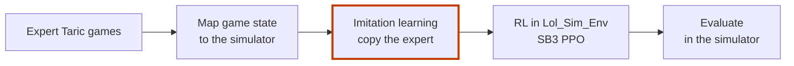

# Taric AI Agent (`taric_ai_agent`)

**The design for an AI that plays Taric in League of Legends. This repo holds the plan, not a working agent.**

A new player learns Taric in two steps. First they watch a good player. Then they play many games and get better.
The agent was designed the same way: copy expert games (imitation learning, IL), then practise in a simulator (reinforcement learning, RL).

- **What is here:** two design documents and a `requirements.txt`. There is no agent code and no trained model.
- **Why read it:** the documents lay out the whole pipeline for a Taric agent in a 2v2 bot lane, file by file.
- **Where it stopped:** the simulator it needed has only its core classes, so the agent never reached play.

Personal project, 2025. Part of **Project Taric**, four repos with one goal, an AI that plays Taric:

| Repo | Part | What exists |
|---|---|---|
| [Taric_Bot_Data](https://github.com/Estaed/Taric_Bot_Data) | The author's own Taric games | Riot API collection and feature scripts |
| [Lol_Data_MCP_Server](https://github.com/Estaed/Lol_Data_MCP_Server) | Game data for the other parts | A working MCP server with 9 tools |
| [Lol_Sim_Env](https://github.com/Estaed/Lol_Sim_Env) | The training lane for RL | Core game classes |
| **Taric_AI_Agent** (this repo) | The agent (IL + RL) | Design documents |

## Read the design

There is nothing to run, so this section points to the documents instead of commands.

- [`docs/taric_ai_agent.md`](docs/taric_ai_agent.md): the project specification (v2.0). Requirements, features and a task-by-task implementation plan.
- [`docs/Architecture_agent.md`](docs/Architecture_agent.md): the file structure and how the agent connects to the other two parts.

`requirements.txt` lists the stack the design picked: PyTorch, Stable-Baselines3, Gymnasium, OpenCV, pynput and psutil.

## How it works (the design)

1. **Collect.** The first design records expert Taric games from the live game: the LCU API, screen recording and input logging. A vision step reads game state from the screen frames.
2. **Map.** Live-game state and actions are translated into the simulator's format. The design treats this as the critical step and checks it first (MVP-first).
3. **Imitate.** A neural network learns to predict the expert's action from the game state.
4. **Practise.** A Stable-Baselines3 PPO agent starts from the IL policy and trains in [Lol_Sim_Env](https://github.com/Estaed/Lol_Sim_Env). The training was meant to run on cloud GPUs.
5. **Evaluate.** IL-only and IL+RL agents are scored in the simulator: KDA, gold and XP difference, ability usage.

How the design changed, and old notes

**Data source.** The later specification (v2.0) moves step 1 to the [LoL Data MCP Server](https://github.com/Estaed/Lol_Data_MCP_Server). The idea was that the server would hand out ready-to-train datasets from high-ELO Taric games (state-action pairs, extra features, scenario labels). Live-game collection stayed as a fallback. The MCP server as published has no dataset tool; its 9 tools serve champion, item and rune data.

**Core components in the design.**

- Live data collector: LCU data, screen frames and player inputs.
- Vision processor: game state from screen recordings.
- State/action mapper: live game data to the simulator's format.
- IL policy network: action prediction.
- RL agent: Stable-Baselines3 PPO, trained in the simulator.

**External data sources.**

- [League of Legends Wiki](https://wiki.leagueoflegends.com/en-us/): champion abilities and game mechanics.
- [Riot Games API](https://developer.riotgames.com/): live game data and LCU integration.

**Cursor settings.** For League of Legends context while coding, open Cursor Settings, then `Cursor: Docs`. Add the League of Legends Wiki and the Riot API docs as documentation sources, and enable indexing for champion names, abilities and game terms.

**Status.** The repo has no code. Its last commit (June 2025) updated the documentation.

---

Taric AI Agent is not endorsed by Riot Games. League of Legends is a trademark of Riot Games, Inc.
